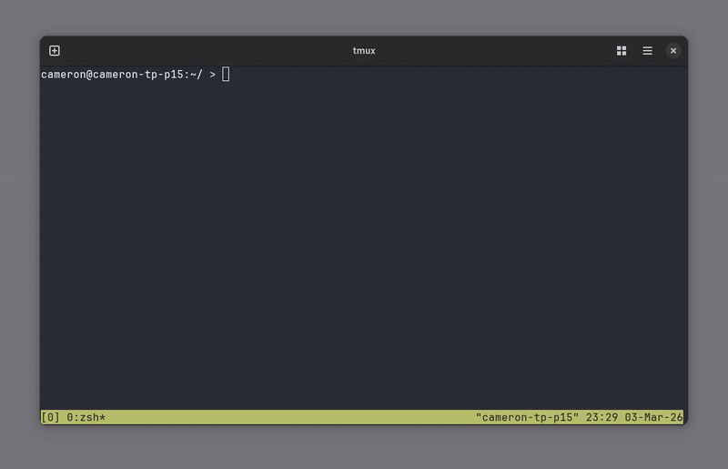

# helpme

`helpme` is a Bash script that opens a new tmux split and starts an assistant CLI with context from your original pane.



## Install

Install with Nix:

```bash
nix profile install github:cameronfyfe/helpme
```

Or, from this repo directory, install `helpme` into your `PATH`:

```bash
install -Dm755 ./helpme ~/.local/bin/helpme
```

Or install system-wide:

```bash
sudo install -m 755 ./helpme /usr/local/bin/helpme
```

Then verify:

```bash
command -v helpme
```

## Quick Start

Requirements:

- `tmux`
- At least one assistant CLI: `opencode`, `codex`, `claude`, etc

Run from inside a tmux pane:

```bash
helpme
```

Pass the assistant command directly (overrides `HELPME_COMMAND`):

```bash
helpme codex
helpme opencode --prompt
```

## Configuration

`HELPME_COMMAND` is the only configuration variable.

Default when unset:

```bash
opencode --prompt
```

Set it per command:

```bash
HELPME_COMMAND="codex" helpme
HELPME_COMMAND="claude" helpme
```

Positional arguments take precedence over `HELPME_COMMAND`:

```bash
HELPME_COMMAND="claude" helpme codex
```

Set it in your shell config:

```bash
# ~/.zshrc or ~/.bashrc
export HELPME_COMMAND="codex"
```

```bash
# ~/.zshrc or ~/.bashrc
export HELPME_COMMAND="claude"
```

## Development

Format script:

```bash
just fmt
```

Check formatting:

```bash
just fmt-check
```
